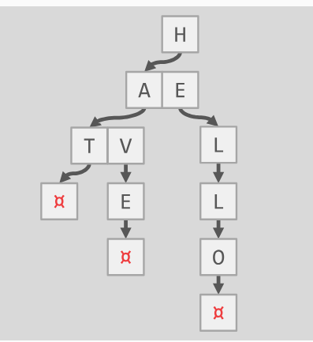

## 实验记录

### Project 0

任务0是要实现一个kv字典树，并且这个字典树可以存储任意类型的数据



##### TrieNode类

TrieNode是我们要实现的第一个类，为了实现char->child的映射，使用了

```cpp
std::unordered_map<char, std::unique_ptr<TrieNode>> children_;

// 注意，这里统一使用了unique_ptr智能指针对数据进行管理，这样的好处就是TrieNode只能当一颗Trie的节点，不会出现连接到其他Trie上的情况
```


* [X] `TrieNode(char key_char)`

- 构造函数，对一个节点赋值key，并且标记为非终端节点

* [X] `TrieNode(TrieNode &&other_trie_node)`

- 移动拷贝构造函数

* [X] `bool HasChild(char key_char)`

- 判断节点是否有key为key_char孩子节点，直接根据map进行查询即可

* [X] bool HasChildren()

- 判断节点是否有任意一个孩子，直接判断map是不是empty

* [X] bool IsEndNode()

- 直接返回是否为终端节点变量即可

* [X] char GetKeyChar()

- 得到当前节点存储的key值

* [X] std::unique_ptr `<TrieNode>` *InsertChildNode(charkey_char, std::unique_ptr `<TrieNode>` &&child)

- 插入孩子节点，先看chidlren_map中是否已经存在对应的key值了，日报存在直接返回null，如果不存在就直接插入即可。

* [X] std::unique_ptr `<TrieNode>` *InsertChildNode(charkey_char, std::unique_ptr `<TrieNode>` &&child)

- 同理

* [X] void RemoveChildNode(char key_char)

- 直接在chidren_map中删除就行了，不需要考虑内存管理，因为我们使用了unique_ptr对象，自动帮我们销毁对象
- [X] void SetEndNode(bool is_end)

* [X] `TrieNode(char key_char)`

- 构造函数，对一个节点赋值key，并且标记为非终端节点

* [X] `TrieNode(TrieNode &&other_trie_node)`

- 移动拷贝构造函数

* [X] `bool HasChild(char key_char)`

- 判断节点是否有key为key_char孩子节点，直接根据map进行查询即可

* [X] bool HasChildren()

- 判断节点是否有任意一个孩子，直接判断map是不是empty

* [X] bool IsEndNode()

- 直接返回是否为终端节点变量即可

* [X] char GetKeyChar()

- 得到当前节点存储的key值

* [X] std::unique_ptr `<TrieNode>` *InsertChildNode(charkey_char, std::unique_ptr `<TrieNode>` &&child)

- 插入孩子节点，先看chidlren_map中是否已经存在对应的key值了，日报存在直接返回null，如果不存在就直接插入即可。

* [X] std::unique_ptr `<TrieNode>` *InsertChildNode(charkey_char, std::unique_ptr `<TrieNode>` &&child)

- 同理

* [X] void RemoveChildNode(char key_char)

- 直接在chidren_map中删除就行了，不需要考虑内存管理，因为我们使用了unique_ptr对象，自动帮我们销毁对象

* [X] void SetEndNode(bool is_end)

- 设置为终端节点

##### TrieNodeWithValue类

这个类继承自TrieNode，这个类比TrieNode类多了一个value属性，这个value是泛型类，可以支持任意类型的数据，构造函数方式有如下两种：

```cpp
explicit TrieNodeWithValue(TrieNode &&trieNode, T value) //基于TrieNode
explicit TrieNodeWithValue(char key_char, T value) // 重新构建

```

* [X] T GetValue();

- 返回节点中的Value，因为Value属于T的泛型，所以要加上T

##### Trie类

Trie是最终的字典类，有一个关键的结构为root_，一切查找都从这里查，root_被初始化key_char为 `a`

* [X] bool Insert(conststd::string &key, T value)

- 向Trie中插入一个kv对，思路就是从root开始逐层遍历，注意如果某个key已经存在，我们需要直接返回，原来的值不能被修改

* [X] bool Remove(conststd::string &key)

- remove的思路很简单，使用递归来实现，如果递归到最后一个字符了，判断一下是否为终端节点，如果是终端节点，那么我们就返回false，如果是终端节点但是还有孩子节点，那么就不能直接删除了，我们需要直接将其标记为非终端节点即可

* [X] `T GetValue(const std::string &key, bool* success)`

- 返回对应key的value值

##### 踩坑记录

1. 为了保证线程安全，我们加上了读写锁，但是忽略了一点，就是我们实现的代码里面有递归操作，会导致死锁，所以将锁换成可重入锁就行了

* [ ] bool Insert(conststd::string &key, T value)

- 向Trie中插入一个kv对，思路就是从root开始逐层遍历，注意如果某个key已经存在，我们需要直接返回，原来的值不能被修改

* [ ] bool Remove(conststd::string &key)

- remove的思路很简单，使用递归来实现，如果递归到最后一个字符了，判断一下是否为终端节点，如果是终端节点，那么我们就返回false，如果是终端节点但是还有孩子节点，那么就不能直接删除了，我们需要直接将其标记为非终端节点即可

### Project 1

#### 做前必读

**DiskManager类**

创建一个磁盘管理类，用于向指定的数据库db文件写入

主要需要注意的如下四个函数，实现其实很简单。

```cpp
virtual void WritePage(page_id_t page_id, const char *page_data);
virtual void ReadPage(page_id_t page_id, char *page_data);
void WriteLog(char *log_data, int size);
auto ReadLog(char *log_data, int size, int offset) -> bool;
```

**Page类**

Page类主要是对数据库系统中的存储单元做的一个封装，在这个类中主要有三个成员变量需要注意

```cpp
page_id_t page_id_ // 当前page页的id
int pin_count_ // 被线程使用的数量
bool is_dirty_ // 是否为脏页
```

因为数据库是多线程访问的，所以需要对page页做线程安全的保护，内部提供了一个读写锁，其实现原理也很简单，直接调库，使用 `std::shared_mutex` 即可。

#### 任务

##### extendible_hash_table

难点在于Bucket的分裂和directory的扩展

分裂的思路就是创建两个bucket，然后将对应的指针指向这两个新的bucket，然后取出原来bucket中的元素做rehash操作

directory的扩展思路就是将目录的大小resize到原来的两倍，然后将0-size的内容拷贝到size~2*size中即可

##### 踩坑记录

1. 最开始实现可扩展哈希的时候参考的文章是[这篇](https://www.geeksforgeeks.org/extendible-hashing-dynamic-approach-to-dbms/)，这篇文章的可扩展哈希不光目录dir是可扩展的，其bucket也是可扩展的，但是官方给的例子里面，bucket的大小是固定的，所以就导致测试一直过不去。
2. 注意新克隆出来的bucket其共享槽的方式！ 因为这个

##### LRUK_Replacer

我的LRUK_Replacer实现思路是，第一层为FIFO队列，第二层为LRU队列。这两个队列都是以双向循环链表为基础实现的。其中为了对LRUK的实现提供支持，我对双向循环链表添加了一个根据 `visite_count_`有序插入的函数，如下：

```cpp
auto DoubleLinkedList<Key>::InsertOrdered(Node *node) -> bool;
```

为了支持LRUK的evict操作，我们将根据如下表寻找第一个被淘汰的节点

```cpp
auto DoubleLinkedList<Key>::FindFirstEvictableNode() -> Node *;
```

因为 `history_list(fifo_list)`和 `lru_list`都有一个特点，就是即将淘汰的放在首位，对于前者我们根据visite_count_进行排序，对于后者我们将最近访问的元素放在链表尾处

实现了上述的双向循环链表之后，lru_k的实现就简单很多了。

```cpp

class LruK {
  using Node = DoubleLinkedList<frame_id_t>::Node;
  using LRU_List = DoubleLinkedList<frame_id_t>;
  using History_List = DoubleLinkedList<frame_id_t>;
  using Map = std::unordered_map<frame_id_t, Node *>;

  int capacity_;
  int k_;

  LRU_List lru_cache_;
  History_List history_cache_;
  Map history_map_;
  Map lru_map_;

 public:
  LruK(int size, int K);
/*
Access实现思路，有两层cache，第一层由history_list组层的有序链表，第二层由lru_list组层的链表，其中两层都有对应的哈希表做访问加速。

首先访问第一层，第一层如果命中，看访问次数是否达到k次，如果达到则插入到第二层
如果第一层没有命中，则去访问第二层，第二层命中之后更新cache的排序
*/
  void Access(frame_id_t id);
/*
Evict实现思路：
先淘汰第一层history_list中的元素，从history_list第一个节点开始遍历，如果节点设置为可淘汰的，那么淘汰掉
如果第一层没有可淘汰的，那么就淘汰第二层lru_list中的元素，从lru_list第一个节点开始遍历，如果节点设置为可淘汰的，那么淘汰掉
*/
  auto Evict(frame_id_t *id) -> bool;
  auto Contained(frame_id_t id) -> bool;
  auto SetEvictable(frame_id_t id, bool evictable) -> bool;
  auto Remove(frame_id_t id) -> bool;

  auto Size() -> int;
  auto IsFull() -> bool;
};

```

##### 踩坑记录

1. 内存泄露导致我检查了好久，一定要注意new和delete搭配起来使用！

##### BufferPoolManagerInstance

* [X] `NewPgImp( page_id * page_id) -> Page *`

* 在缓存池中创建一个新的页，然后将这个页的page_id 设置到传进来的这个参数中，如果没有空闲的页框 且 没有可以驱逐的页，那么就返回一个空，否则就返回创建的这个页的地址

* [X] `auto FetchPgImp(page_id_t page_id) -> Page* `

  - 从缓存池中根据指定的page_id找到对应的page，然后返回这个page的内存地址。 首先从已有的缓冲池中找，如果找到了则返回，如果没找到则说明需要再磁盘中读取。 如果需要在磁盘中读取的话，必须保证缓存池中有可以驱逐的页，如果没有直接返回空值。 如果page_id无效值，也直接返回空值
* [X] `auto UnpinPgImp(page_id_t page_id,  bool is_dirty) -> booloverride`

  - 减少某个page pin的个数，如果 pin 个数已经是0或者page_id不存在 则返回false。 is_dirty可以用来设置页是否为脏页。
* [X] auto FlushPgImp(page_id_t page_id)  -> bool

  - 将指定的页刷新到磁盘中，注意刷新之后将dirty flag设置为false
* [X] ` void FlushAllPgsImp()`

  - 将所有页都刷新到磁盘中
* [X] `auto DeltePgImp(page_id_t page_id) -> bool`

  - 根据指定的page_id从缓冲池中删除，如果page的pin个数还大于0则说明有线程还在使用，则直接返回false。 当我们删除了这个page之后，这个page所在的lru也应该被删除。

### project2

本节主要是需要再我们的数据库中实现一个B+树索引

#### 难点1：B+树的并发控制

当有多个线程对B+树进行并发访问的时候会发生什么呢？

1. 线程A对结点1发出读操作，这时候线程B对结点1发出写操作，这就可能会导致线程B把结点1原来的数据覆盖掉了，导致线程A读出来的不是自己想要的数据
2. 线程A对通过结点1的父亲节点找到了结点1的指针，但是线程B对结点1进行了插入/删除操作，发生split/merge操作，导致结点1的数据发生变化，我想访问的数据原本在结点1上，现在被移动到结点2上去了。

**解决方案1：大锁**

 每次在进行读写的时候直接加上一把大锁！

缺点：速度太慢！毫无并发性可言

##### 解决方案2：latch crabbing

1. 在对结点seach的过程中，从上往下加上读锁，获得子节点之后，可以立即释放父结点的锁（因为不在需要访问父亲节点了）
2. 在对结点进行insert/delete操作的过程中，从上往下开始加写锁，获得子节点的写锁之后判断子节点是否是安全的，如果是安全的就解除所有祖先的节点的写锁。什么叫做安全呢？所谓“安全"指的是如果一个结点插入一个数据或者删除一个数据都不会引起结点的分裂或者合并，就说明这个节点是安全的。

##### 无锁的解决方案1：


##### 无锁的解决方案2：


#### 难点2：实现B+树

**B+树例子**


B+数与B树区别

* 非叶子节点只存储键值信息，数据记录都存放在叶子节点中。
* 所有叶子节点之间都有一个链指针。
* 非叶子节点的关键字的个数与其子树的个数相同，不像B树，子树的个数总比关键字个数多1个。

**插入数据**

* 插入数据时首先定位到数据所在的叶子结点，然后将数据插入到该结点，插入数据后不能破坏关键字自小而大的排列顺序。
* 若插入元素后该节点关键字数目<=阶数M，则直接完成插入操作。
* 若插入的元素为该节点的最大值，则需要修改其父结点中的索引值。
* 若插入元素后该节点关键字数目>阶数M，则需要将该结点分裂为两个结点，关键字的个数分别为：floor((M+1)/2)和ceil((M+1)/2)。
* 若分裂结点后导致父节点的关键字数目>阶数M，则父节点也要进行相应的分裂操作。

下图是插入关键字：15后的结果：


* 若被插入关键字所在的结点，其含有关键字数目等于阶数M，则需要将该结点分裂为两个结点。

上图中插入关键字：9后结点的关键字数量为：4，超过了B+树阶数M，因此需要进行结点分裂操作，分裂后的结果为：


